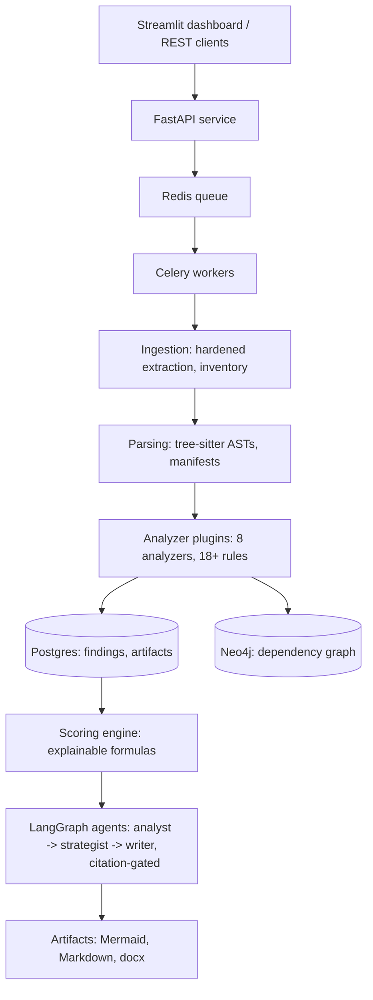

# LegacyLens Architecture

## Thesis

**Deterministic static analysis produces facts; AI produces judgment
grounded in those facts — never the reverse.**

Every capability in the system exists to enforce that sentence:

- A `Finding` cannot be constructed without at least one `Evidence`
  record (Pydantic-enforced invariant).
- LLM agents receive a findings digest — never raw code — and every
  output section must cite real finding IDs, checked by a validator node
  that rejects and retries on violation.
- Scores are computed by named, capped formulas and ship their component
  breakdowns; the LLM explains numbers, it never produces them.
- Diagrams are rendered from graph data by string assembly, never
  paraphrased through a model.

## Layers

## Execution model

Upload → `POST /projects` streams the archive to disk with a byte cap,
creates a `pending` project row, enqueues a job, returns 202. A Celery
worker (acks_late, prefetch=1, no auto-retries) runs `run_analysis()`:
ingest → pipeline → score → synthesize (optional) → report → persist.
Any exception transitions the job to `failed` with the recorded reason —
a job can never be stuck `running`.

The pipeline itself is a topologically-ordered plugin run: analyzers
declare `depends_on`, the registry sorts them (stdlib `graphlib`), one
analyzer's crash skips its dependents with a recorded reason and the rest
continue. Partial analysis of a legacy system is still valuable analysis.

## Decision log

| # | Decision | Why |
|---|---|---|
| 1 | Evidence is a type-system invariant | "No random recommendations" as a `ValidationError`, not a guideline |
| 2 | Analyzer plugin contract (`id`, `depends_on`, `analyze`) | New capability = one file; registry topo-sorts execution |
| 3 | Provenance stamped by the runner | Analyzers cannot spoof `analyzer_id`; the citation chain stays trustworthy |
| 4 | tree-sitter, manual node walks (no query API) | One parser stack for 3 ecosystems; survives binding churn |
| 5 | Dotted-suffix import resolution | Layout-agnostic (src/, app/, bare) Python and Java classpath matching |
| 6 | External facts from endoflife.date / OSV.dev | "Spring 4.3 is EOL" is a cited authority, not model memory; 404 = valid None; failures degrade to an explicit lower-bound note |
| 7 | Python computes graph algorithms, Neo4j persists | Batch SCC/waves in-process; the database serves interactive exploration |
| 8 | Iterative Kosaraju SCC | Recursion depth is input-controlled on 50k-file repos (tested at 20k) |
| 9 | Secret redaction tested over serialized findings | A secrets scanner must not exfiltrate secrets into its own report |
| 10 | Scoring is a post-pipeline stage with capped, itemized formulas | Breakdown must sum to the score (tested); LLMs are unreliable at numbers |
| 11 | Citation validation as a LangGraph node | Hallucination prevention is a pipeline stage, not a prompt request; violations feed the retry prompt verbatim |
| 12 | Celery task = one-line shell around a plain function | The whole service lifecycle tests with SQLite and no broker |
| 13 | Dashboard is a pure HTTP client | Presentation layer verifiably swappable |

## Failure philosophy (uniform across tiers)

| Tier | On failure |
|---|---|
| Analyzer | recorded, dependents skipped with reason, run continues |
| External API | `EVID-UNAVAILABLE-001`: report states the lower bound |
| LLM agent | section marked failed with reason; other agents continue |
| Job | `failed` + error; never stuck `running` |
| Report | missing sections become visible notes, never silence |

## Future enhancements (staff-review backlog)

- Shared file-content cache across analyzers (each currently reads
  independently); incremental re-analysis keyed by file SHA-256.
- Confidence scores on import resolution (dotted-suffix ambiguity) and
  lowercase-SQL detection behind a precision/recall setting.
- Postgres-backed pagination on findings; auth (API keys) and per-tenant
  workspaces; rate limiting on upload.
- C#/PHP analyzers via the existing plugin contract; Alembic migrations
  once the schema stabilizes; LangSmith tracing on agent runs.
- Report PDF export; blast-radius UI backed by the Neo4j store.
